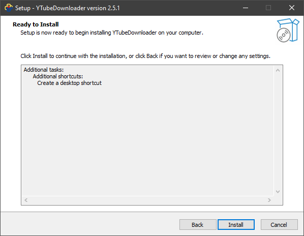
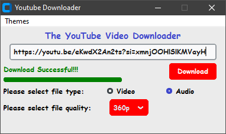

## YTUBEDOWNLOADER APP (Youtube Downloader)

The YouTube Downloader App is a simple yet powerful tool that allows users to download videos from YouTube. With a user-friendly interface, it provides a convenient way to save your favorite videos for offline viewing.

## FEATURES
- Download Options: Easily Download Youtube Videos and Extract Audio with just a few Clicks
- Quality Options: Choose your video quality
- Cross-Platform: Available for Windows

## INSTALLATION
1.	Download the latest release from the Setup Folder.
2.	Install the application on your system by running the installer

3. 	Run the Application with Ease 😊

## USAGE
1.	Launch the YouTube Downloader App.
2.	Copy the URL of the YouTube video you want to download.
3.	Paste the URL into the app.
4.	Choose the desired format and quality.
5.	Click the "Download" button to start the download, Video/Audio will be Downloaded to your `\Downloads` directory 

## SCREENSHOTS

## DEVELOPMENTS
If you want to contribute to the development of the YouTube Downloader App, follow these steps:

1.	Clone the repository: ``git clone https://github.com/wiseman-umanah/YTubeDownloader.git``
2.	Install Libraries:
		`pip install pytube`
3.	Make your changes.
4.	Submit a pull request.

## BUGS
There are no bugs at the time of development, if found contact me 📩 wisemanumanah@gmail.com

## LICENSE
This project is licensed under the [MIT License](https://opensource.org/license/mit/).

## ACKNOWLEDGMENTS
We would like to express our gratitude to the following individuals and projects that contributed to the development of the YouTube Downloader App:

pytube Library: Special thanks to the developers of the pytube library for providing a powerful and easy-to-use Python library for interacting with YouTube.

GitHub: Our code repository is hosted on GitHub. Thanks to GitHub for providing an excellent platform for version control.

Open Source Community: We appreciate the entire open-source community for sharing knowledge, code, and inspiration. Together, we make great things happen.

THANK YOU FOR USING MY APP 😊
